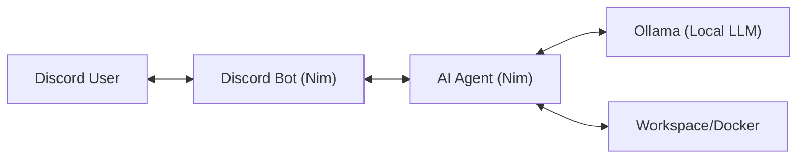

# Sweet Berry Agent

ローカルLLM（Ollama）を活用して動作する、Sweet Berry Agent システムです。

## プロジェクト概要

このシステムは、Discord経由で指示を受け取り、ローカルで動作するAIエージェントがタスクを実行することを目的としたアーキテクチャを採用しています。



## 技術スタック

- **言語**: Nim 2.0.0
- **実行環境**: Docker / Docker Compose
- **Discordライブラリ**: [dimscord](https://github.com/nim-lang/dimscord)
- **通信**: WebSocket (ws)
- **推論エンジン**: [Ollama](https://ollama.com/)
- **拡張機能**: MCP (Model Context Protocol) サーバー対応 / カスタムスキル

## ディレクトリ構成

- `bot/`: Discord Bot本体（インターフェース層）
- `agent/`: AIエージェントサーバー（ロジック層）
- `agent/skills/`: エージェントに追加するカスタムスキル格納場所
- `agent/workspace/`: エージェントが作業を行うサンドボックスディレクトリ
- `docker-compose.yml`: 環境全体のオーケストレーション設定

## MCPサーバーとスキルの利用

### MCPサーバーの追加
`docker-compose.yml` の `agent` コンテナ内の環境変数に、MCPサーバーの設定を記述することで連携が可能です。

### カスタムスキルの追加
`agent/skills/` ディレクトリにスキル定義を配置することで、エージェントの機能を拡張できます。

## 事前準備

1. **Ollamaのインストールとモデルの準備**
   - ホストマシンでOllamaが動作している必要があります。
   - `llama3` モデルをプルしておいてください。
     ```bash
     ollama pull llama3
     ```
2. **Discord Botの作成**
   - [Discord Developer Portal](https://discord.com/developers/applications)でアプリケーションを作成し、Botトークンを取得してください。

## 起動手順

1. **環境変数の設定**
   `.env.example` を `.env` にコピーし、必要事項を記入します。
   ```bash
   cp .env.example .env
   ```

2. **コンテナの起動**
   ```bash
   docker compose up -d
   ```

## 使用方法

### Discordコマンド
- `!help`: 利用可能なコマンドの一覧を表示します。
- `!schedule "プロンプト" 間隔`: 定期実行タスクを登録します。
  - 例: `!schedule "ディスク使用率をチェックして報告" 12h`
  - 日本語の時間単位も使用可能です: `秒`, `分`, `時間`, `日` (例: `!schedule "..." 30分`)
- `!schedules`: 現在登録されているスケジュールの一覧を表示します。
- `!unschedule 番号`: 指定した番号のスケジュールを削除します。
- **ボットへのメンション**: メンション付きでメッセージを送ると、AIエージェントがその指示に従って作業を開始します。

## 運用者向けガイド

### ログの確認
システムは日本語のタグを用いてログを出力します。
- `[報告]`: 正常な動作や状態の変更。
- `[警告]`: 注意が必要な事象や軽微なエラー。

```bash
docker compose logs -f
```

### データの永続化
定期実行スケジュールは `/app/data/schedules.json` に保存されます。ホスト側では `./bot/data/` ディレクトリにマウントされています。

### トラブルシューティング
- **エージェントに接続できない**: `agent` コンテナが起動しているか、ポート8000が開放されているか確認してください。ボットには再試行ロジックが組み込まれていますが、3回失敗すると停止します。
- **AIの応答が遅い/返ってこない**: Ollamaの負荷状況を確認してください。特に初回実行時はモデルのロードに時間がかかる場合があります。
